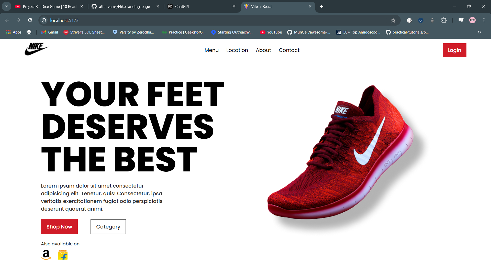

# Nike Landing Page

A simple Nike-themed landing page built as a React practice project. The page contains basic navigation and a hero section featuring a catchy phrase and a shoe image. Basic global CSS is used for styling the page.

## Features

- **Navigation showcase**: Includes basic navigation links for demonstration.
- **Hero Section**: Highlights a stylish shoe with a captivating phrase.

## Purpose

This project is designed for practicing React fundamentals, including component structure, props, and basic styling using global CSS.

## Preview



## Getting Started

Follow these instructions to set up and run the project on your local machine.

### Prerequisites

- Node.js installed on your system
- A code editor (e.g., VS Code)

### Installation

1. Clone the repository:

   ```bash
   git clone https://github.com/atharvams/Nike-landing-page.git

   ```

2. Navigate to project folder:

   ```bash
   cd nike-landing-page

   ```

3. Install dependencies:
   ```bash
   npm install
   ```

# Running the applicaiton:

1. Run the local server: (vite build tool)

   ```bash
   npm run dev

   ```

2. Go to browser:
   ```bash
   http://localhost:5173
   ```

## Contributing

Feel free to fork this repository, submit issues, or make pull requests to improve the project.
