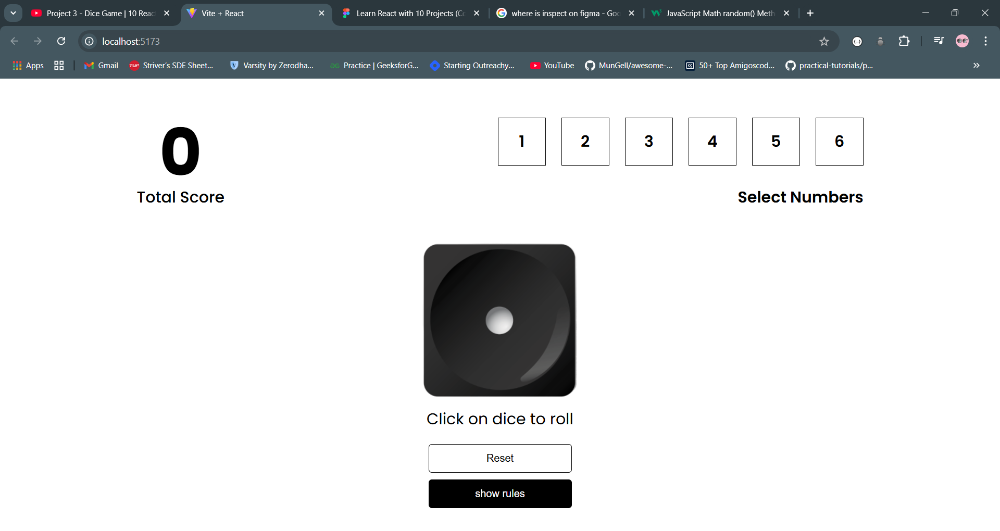

Here's the README.md file content in Markdown code format:

markdown
Copy code
# 🎲 Dice Game

A simple and fun dice game where players can roll virtual dice and see who scores the highest! Perfect for practicing JavaScript or Python and building interactive web or console applications.

## 🚀 Features

- 🎲 Roll one dice with a click of a button.
- 🏆 Displays the winner (highest score).
- 🔄 Replay the game anytime.
- 🖥️ Awesome front end. Works in web browsers.

---

## Preview



## Getting Started

Follow these instructions to set up and run the project on your local machine.

### Prerequisites

- Node.js installed on your system
- A code editor (e.g., VS Code)

### Installation

1. Clone the repository:

   ```bash
   git clone https://github.com/atharvams/Dice-Game.git

   ```

2. Navigate to project folder:

   ```bash
   cd 2DiceGame

   ```

3. Install dependencies:
   ```bash
   npm install
   ```

# Running the applicaiton:

1. Run the local server: (vite build tool)

   ```bash
   npm run dev

   ```

2. Go to browser:
   ```bash
   http://localhost:5173
   ```